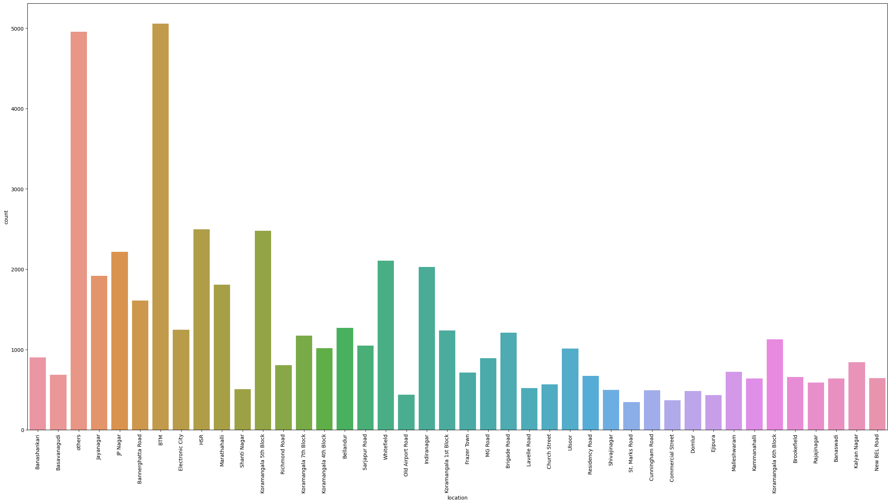

<h1> Zomato Dataset </h1>

<ul>
    <li>The basic idea of analyzing the Zomato dataset is to get a fair idea about the factors affecting the aggregate rating of each restaurant, establishment of different types of restaurant at different places, Bengaluru being one such city has more than 12,000 restaurants with restaurants serving dishes from all over the world.  </li>
    <li>With each day new restaurants opening the industry has'nt been saturated yet and the demand is increasing day by day.  </li>
     <li>Inspite of increasing demand it however has become difficult for new restaurants to compete with established restaurants.   </li>
    <li>Most of them serving the same food. Bengaluru being an IT capital of India. </li>
     <li>Most of the people here are dependent mainly on the restaurant food as they don't have time to cook for themselves.  </li>
    <li>With such an overwhelming demand of restaurants it has therefore become important to study the demography of a location.   </li>
</ul>
<br>
<hr>

<h4> Import Libraries </h4>

```
import numpy as np
import pandas as pd
import matplotlib.pyplot as plt
import seaborn as sns
```

<h3> Steps Followed</h3>
<ol>
    <li>Locating path of dataset locally and reading the file using pd.read_csv() </li>
    <li> Get information about shape and columns of dataset, to look and remove and not required columns </li>
    <li> Drop the unrequired datasets </li>
    <li>Get the information about number of null values in the dataset </li>
    <li>Dropping the Duplicate rows in the dataset </li>
    <li> Featuring each columns according to our convinience and necessity </li>
    <li>Cleaning the Data</li>
    <li>  Start Visualization and Get Insights</li>
</ol>

<hr>
<h2> Location </h2>

```
plt.figure(figsize=(20,15))
ax= sns.countplot(x=df['location'],data=df)
plt.xticks(rotation=90)
plt.show()
```
<br>



<hr>
<i><u><h2>Insight 1</h2></u></i>
<li> From the above chart we can notice, there are more restarants in areas like BTM.</li> 
 <li>So opening at BTM might be risky </li>


<hr>


<h2> Online Order </h2>

```
plt.figure(figsize=(5,5))
sns.countplot(x=df['online_order'],palette='inferno',data=df)
plt.show()
```


<hr>
<i><u><h2>Insight 2</h2></u></i>
<li> More people are ordering Online</li> 
<hr>